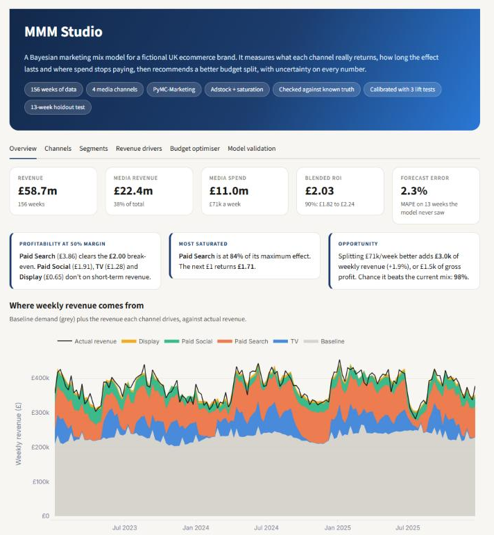
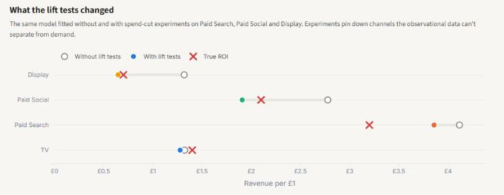
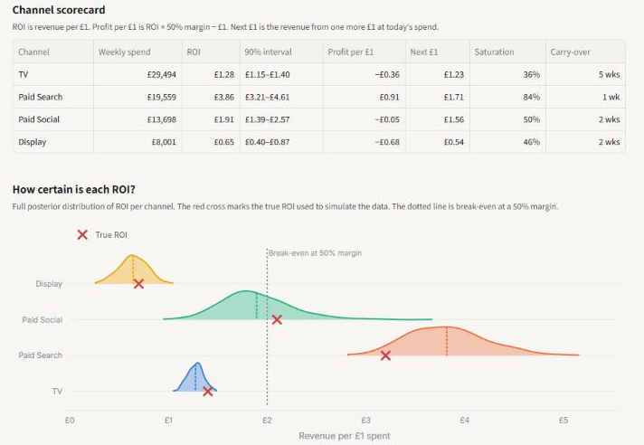
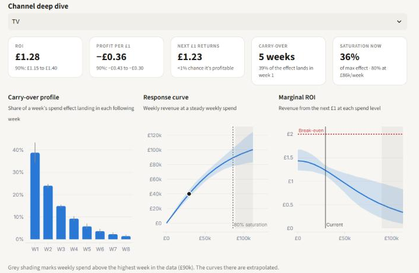
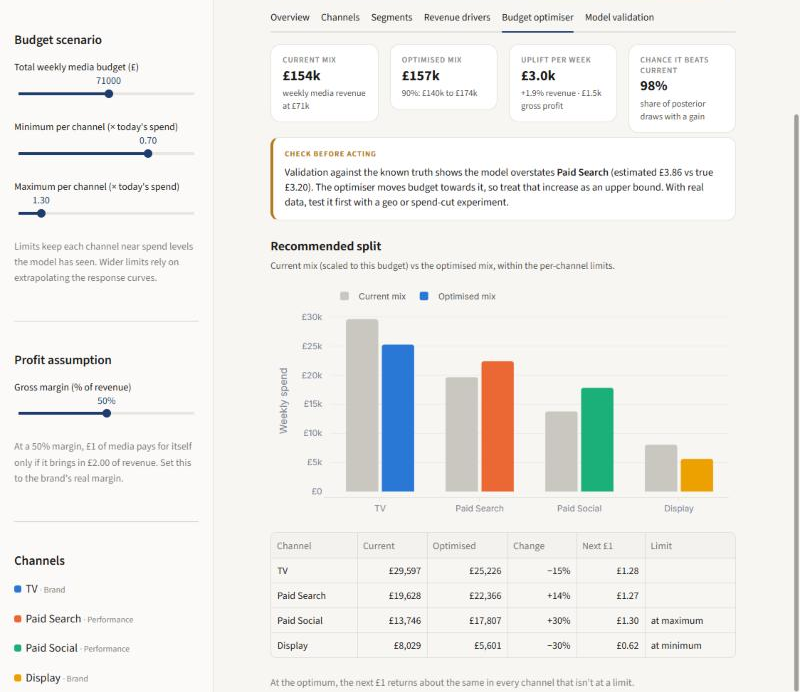
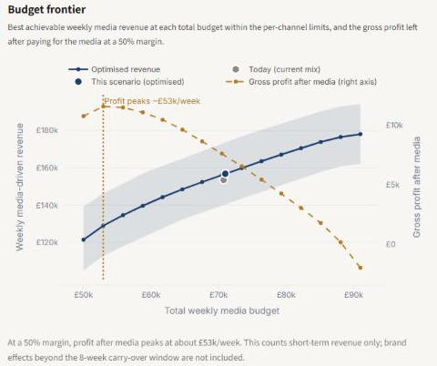
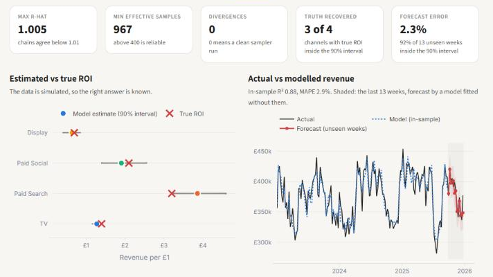
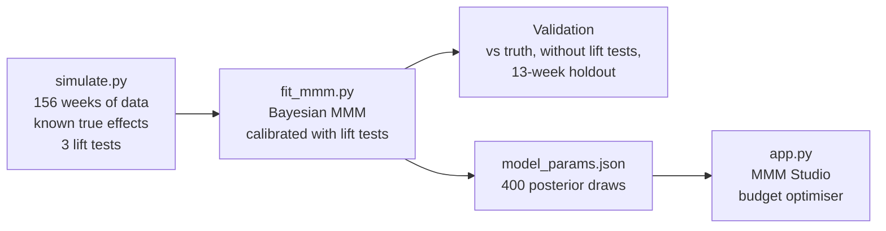

# MMM Studio: a Bayesian marketing mix model, calibrated with experiments

**How much revenue does each marketing channel really drive, and where should the next pound go?**
A Bayesian marketing mix model (MMM) built with [PyMC-Marketing](https://github.com/pymc-labs/pymc-marketing), calibrated with lift tests, checked against a known truth and turned into an interactive budget planner.

**[Open the live app](https://bayesian-mmm-ebwrjpzjcdqs6atqiaihea.streamlit.app/)** · [Results](#results) · [The app](#the-app) · [How it works](#how-it-works) · [Run it yourself](#run-it-yourself)




## Why this project

Most MMM projects fit a model and report what it says. Nobody can check those numbers, because real data never reveals the true return on a channel.

So I simulated three years of weekly data for a fictional UK ecommerce brand that spends about £71k a week across TV, paid search, paid social and display, with every channel's true effect known in advance. That turns the project into a test: does the model find the right answer, and what does it take to get there?

## Results

**The model alone got it wrong. Experiments fixed most of it.** Fitted on sales data alone, the model over-credited three of the four channels by 29% to 88%. Adding three simulated lift tests (spend-cut experiments on search, social and display) brought social and display within 9% of the truth and cut the search error from +29% to +21%. Overall, it now credits media with 38% of revenue against a true 37%, down from 45% without the tests.



<!-- RESULTS_START -->
| Channel | True ROI | Model alone | With lift tests | 90% interval | Truth inside interval |
|---|--:|--:|--:|--:|:-:|
| TV (no lift test) | £1.40 | £1.32 (−5%) | **£1.28 (−9%)** | £1.15–£1.40 | Yes |
| Paid Search | £3.20 | £4.12 (+29%) | **£3.86 (+21%)** | £3.21–£4.61 | No |
| Paid Social | £2.10 | £2.78 (+32%) | **£1.91 (−9%)** | £1.39–£2.57 | Yes |
| Display | £0.70 | £1.32 (+88%) | **£0.65 (−8%)** | £0.40–£0.87 | Yes |

- **Forecast on 13 unseen weeks:** 2.3% average error (MAPE), 12 of 13 weeks inside the 90% interval
- **In-sample fit:** R² 0.88, MAPE 2.9%
- **Sampler:** max R-hat 1.005, min bulk ESS 967, 0 divergences
<!-- RESULTS_END -->

ROI is revenue per £1 of media. The table refreshes automatically each time the model is fitted.

### What it tells the business

These findings assume a 50% gross margin, which is a setting in the app. At that margin, £1 of media has to bring in £2 of revenue to pay for itself.

- **Paid Search is the most efficient channel, but close to its ceiling.** It returns £3.86 per £1 on average and is already at 84% of its maximum effect, so the next £1 brings back £1.71.
- **Only Paid Search clearly pays for itself on short-term revenue.** Paid Social (£1.91, 90% interval £1.39 to £2.57) is too uncertain to call. TV (£1.28) and Display (£0.65) fall well short.
- **The same budget can work harder.** Moving money from TV and Display into Social and Search, with every channel kept within 30% of today's spend, adds £3.0k of revenue a week (+1.9%). The model gives it a 98% chance of beating the current mix.
- **On short-term returns, profit after media peaks at about £53k a week, below today's £71k.** Brand effects that build over months are outside this model, so this is a reason to run a test, not to cut spend.

## The app

MMM Studio is a Streamlit app built on 400 posterior draws from the fitted model, so every number carries its uncertainty. The sidebar sets the weekly budget, how far each channel may move from today's spend and the gross margin.

| Tab | What it answers |
|---|---|
| **Overview** | Where revenue comes from, which channels pay back at the chosen margin, and the biggest opportunity |
| **Channels** | ROI, profit per £1, return on the next £1, saturation and carry-over per channel, with full posterior distributions |
| **Segments** | Brand vs performance, ROI by year and by quarter |
| **Revenue drivers** | A waterfall from base demand, trend, seasonality, pricing and promotions through each channel to total revenue |
| **Budget optimiser** | The best split for any budget, the uplift with a 90% interval, and where profit after media peaks |
| **Model validation** | Sampler diagnostics, every estimate against the truth, what the lift tests changed, and the 13-week holdout forecast |

**Channels:** how certain each ROI is, against the true value and the break-even line.



**Channel deep dive:** TV's effect is spread over about five weeks and its response curve is still far from saturation, but each extra £1 returns less than the £2 needed to break even.



**Budget optimiser:** the recommended split within ±30% of today's spend. The app flags that Paid Search is over-credited, so its increase is an upper bound.





**Model validation:** diagnostics, estimates against the truth, and the forecast for 13 weeks the model never saw (shaded).



## How it works



### 1. Simulated data with a known answer

`src/simulate.py` generates 156 weeks (2023 to 2025) of weekly data:

- **Media spend:** TV in 4-week flights, always-on paid search with quarterly budget changes and two pull-back periods, paid social with slow-moving budgets, and display with two dark periods. A model can only learn a channel's effect if its spend actually moves, so the variation is deliberate.
- **A built-in trap:** paid search spend rises in Q4, when demand rises anyway. This is common in real accounts and makes search look better than it is.
- **Controls:** a price index, promotion weeks, trend and yearly seasonality.
- **Noise:** random week-to-week noise of about 4% of revenue, so the model can't fit perfectly. Real weekly MMMs typically miss by 3–10%.
- **Known truth:** each channel has a true carry-over rate, saturation curve and ROI: TV £1.40, paid search £3.20, paid social £2.10, display £0.70.

### 2. The model

- **Adstock (carry-over):** geometric decay over up to 8 weeks, so TV keeps driving sales after the ads stop.
- **Saturation (diminishing returns):** a logistic curve per channel.
- **Baseline:** intercept, trend, Fourier yearly seasonality, price (as % above or below its average) and promotions.
- **Inference:** NUTS sampling, 4 chains × 1,000 draws. R-hat, effective sample size and divergences are checked before the results are used.

### 3. Calibration with lift tests

Observational data can't separate a channel from the demand it follows, and this is where the uncalibrated model went wrong. Lift tests are the industry's standard fix. Each simulated test cuts a channel's weekly spend and reports the weekly revenue lost, with the measurement error a real geo test would have:

| Channel | Spend change | Measured weekly revenue lost | True loss |
|---|---|--:|--:|
| Paid Search | £20k → £5.9k a week | £41k ± £6.2k | £42k |
| Paid Social | £14k → £6.8k a week | £10k ± £2.8k | £14k |
| Display | £8.0k → £0 a week | £4.3k ± £1.5k | £6.2k |

The tests enter the model as extra observations (PyMC-Marketing's `add_lift_test_measurements`), so each tested channel's response curve has to agree with its experiment. TV is left untested because TV geo tests are expensive and many brands don't run them. The model is also fitted without the tests, which is where the "Model alone" column above comes from.

Two of the tests understate the true effect by about 30%, as real tests sometimes do. The model weighs each test against the sales data rather than copying it.

### 4. Validation

- **Against the truth:** every ROI, and every channel's revenue in every quarter, is compared with the simulated true values.
- **Out of sample:** the model is refitted without the last 13 weeks and has to forecast them. In-sample fit flatters any model, so this is the accuracy number to trust.
- **Sampler health:** R-hat, effective sample size and divergences for every parameter.

### 5. From model to decisions

- **Profit, not just revenue:** the app converts ROI into profit per £1 using the gross margin, so break-even sits at £1 ÷ margin, not £1.
- **Optimiser:** splits a weekly budget to maximise expected revenue (SciPy SLSQP on the posterior-mean response curves). It keeps each channel within a set range of today's spend (±30% by default), because response curves are unreliable beyond the spend levels in the data. The uplift and the probability of beating the current mix come from all 400 posterior draws.
- **Budget frontier:** the best achievable revenue at every total budget, and where gross profit after media peaks.

## Limitations and next steps

- **Paid Search is still over-credited (+21%).** One lift test only partly offsets spend that tracks Q4 demand. A second test at a different time of year or spend level is the next step.
- **TV has no lift test,** so its estimate rests on the sales data alone. A geo test would tighten it.
- **Short-term effects only.** Brand building that lasts beyond the 8-week carry-over window isn't measured, so TV and display are likely undervalued. This is a known weakness of MMMs in general.
- **The optimiser assumes a steady weekly spend,** so it gives a long-run view, not a flighting plan.
- **The data is simulated.** Real data adds messier problems, such as tracking gaps, competitor activity and regional differences. A regional (geo-level) model would be the natural extension.

## Run it yourself

On Windows, double-click `run_mmm.bat`. It installs Miniforge if needed, creates the environment, simulates the data, fits the models and opens the app.

On any system:

```bash
conda env create -f environment-model.yml
conda activate bayesian-mmm
python src/simulate.py      # creates data/, including the lift tests
python src/fit_mmm.py       # calibrated fit, comparison fit and holdout test (5–15 min)
streamlit run app.py
```

The fitted results are saved in `outputs/`, so the app runs without PyMC. `requirements.txt` holds only what the app needs, which is what Streamlit Community Cloud installs. The full modelling environment is in `environment-model.yml`.

## Project structure

```
app.py               MMM Studio, the Streamlit app
src/simulate.py      simulated data, known true effects and lift tests
src/fit_mmm.py       model fit, calibration, diagnostics, validation and holdout test
src/optimiser.py     response curves and budget optimisation from the posterior
src/analytics.py     scorecard, segments, saturation, drivers and budget frontier
src/transforms.py    adstock and saturation functions, matching PyMC-Marketing's
data/                simulated data, ground truth and lift tests
outputs/             fitted parameters, decomposition, holdout forecast and charts
docs/images/         screenshots for this page
run_mmm.bat          one-click setup and run on Windows
environment-model.yml  full conda environment for fitting the model
requirements.txt     what the app needs (used by Streamlit Community Cloud)
```

## Built with

Python 3.12 · PyMC-Marketing 1.2 (PyMC, NUTS sampling) · ArviZ · SciPy · pandas · Streamlit · Plotly

## About

Built by **Razaq Abdi**. I'm a marketing graduate and analyst interested in marketing measurement and effectiveness. [Connect on LinkedIn](https://www.linkedin.com/in/razaqabdi).
